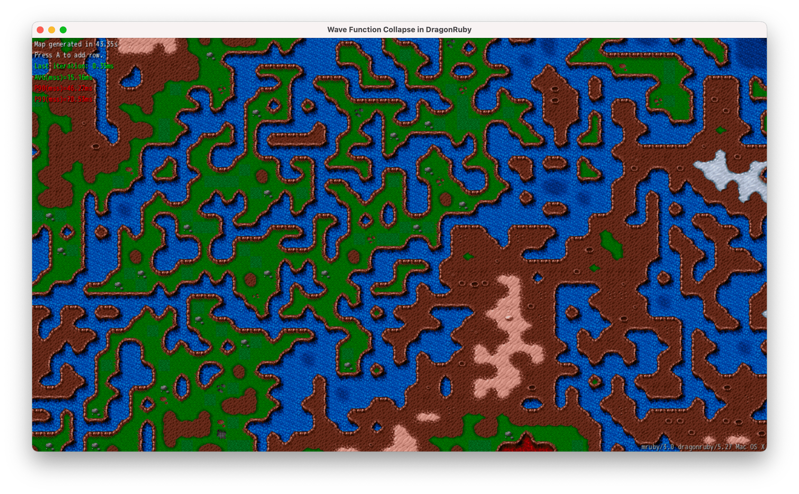

# Wave Function Collapse in DragonRuby

This repository is an example implementation of the [Wave Function Collapse](https://github.com/mxgmn/WaveFunctionCollapse) algorithm using [DragonRuby](https://dragonruby.org/toolkit/game).

The algorithm is used to generate the entire map using tiles based on the rules. Rules are defined using the [Tiled](https://www.mapeditor.org/) program and read by the Ruby program from the [TSJ](https://github.com/pusewicz/wave-function-collapse-dragonruby/blob/main/assets/map.tsj) file.

## Objective

Build the Wave Function Collapse algorithm in Ruby that's fast enough to iterate in a game on each frame.

## Contributing

Bug reports and pull requests are welcome on GitHub at https://github.com/pusewicz/wave-function-collapse-dragonruby. This project is intended to be a safe, welcoming space for collaboration, and contributors are expected to adhere to the [code of conduct](https://github.com/pusewicz/wave-function-collapse-ruby/blob/main/CODE_OF_CONDUCT.md).

## Others

- [Wave Function Collapse in Ruby](https://github.com/pusewicz/wave-function-collapse-ruby)

## License

The gem is available as open source under the terms of the [MIT License](https://opensource.org/licenses/MIT).

## Credits

Tileset: https://opengameart.org/content/consolidated-hard-vacuum-terrain-tilesets
